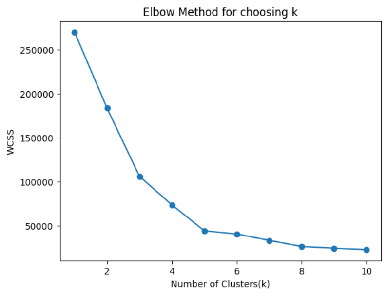
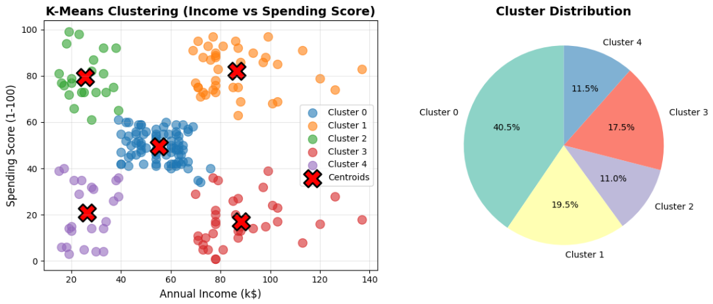
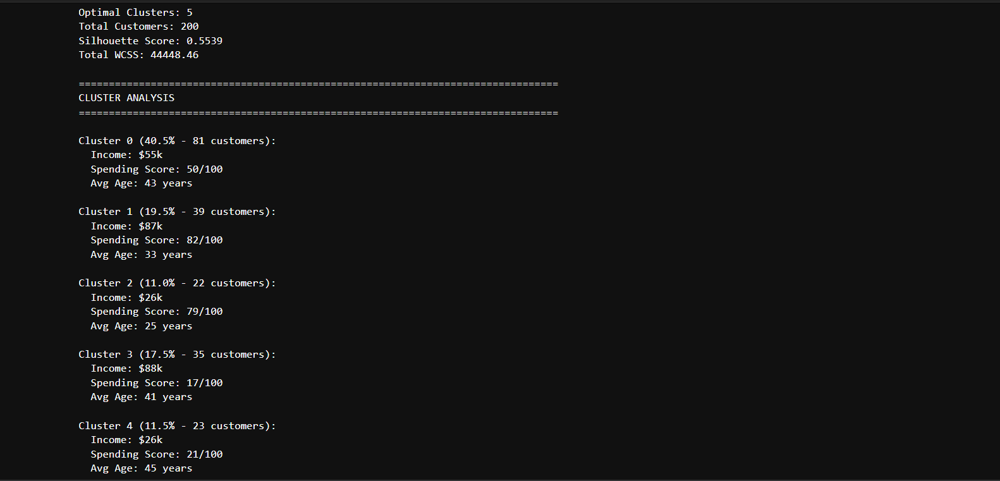
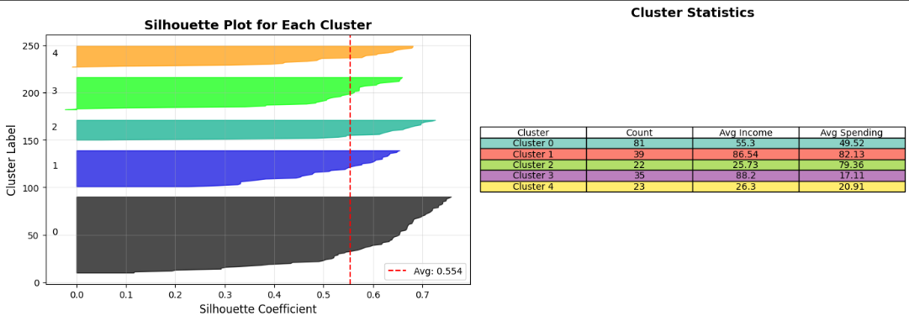

# K-Means Clustering on Mall Customer Dataset

This project implements the K-Means clustering algorithm on a mall customer dataset to segment customers into distinct groups based on their annual income and spending behavior.

## Project Overview

K-Means is an unsupervised learning algorithm that partitions data points into K clusters by minimizing the within-cluster sum of squares (WCSS). This project demonstrates practical application of K-Means clustering for customer segmentation.

## Dataset Information

- **Total Customers**: 200
- **Features Used**: Annual Income (k$), Spending Score (1-100)
- **Data Format**: CSV file with customer information

## Libraries Used

- numpy, pandas, scikit-learn, matplotlib

## Implementation Steps

### Step 1: Data Loading

Loaded the Mall_Customers.csv dataset containing 200 customer records with 5 columns: CustomerID, Gender, Age, Annual Income, Spending Score.

### Step 2: Feature Selection

Selected Annual Income (k$) and Spending Score (1-100) as features for clustering.

### Step 3: Elbow Method for Optimal K

Tested k values from 1 to 10:
- WCSS values show a clear elbow at k=5
- k=5 is the optimal number of clusters

### Step 4: K-Means Model Training

Trained KMeans model with k=5 clusters using k-means++ initialization and random_state=42.

### Step 5: Cluster Analysis

## Results and Metrics

### Overall Performance
- **Optimal Clusters**: 5
- **Silhouette Score**: 0.5539
- **Total WCSS**: 44448.46

### Cluster Distribution
```
Cluster 0: 81 customers (40.5%)
Cluster 1: 39 customers (19.5%)
Cluster 2: 22 customers (11.0%)
Cluster 3: 35 customers (17.5%)
Cluster 4: 23 customers (11.5%)
```

### Cluster Centers (Centroids)
```
Cluster | Income (k$) | Spending Score | Avg Age
--------|-------------|----------------|--------
   0    |   55.30     |     49.52      |   43
   1    |   86.54     |     82.13      |   33
   2    |   25.73     |     79.36      |   25
   3    |   88.20     |     17.11      |   41
   4    |   26.30     |     20.91      |   45
```

### Detailed Cluster Profiles

**Cluster 0 - Average Customers (40.5%)**
- Income: $55,300 | Spending: 49.52/100 | Age: 43 years
- Profile: Middle-income with moderate spending

**Cluster 1 - Target Customers (19.5%)**
- Income: $86,540 | Spending: 82.13/100 | Age: 33 years
- Profile: High-income, high-spending (MOST VALUABLE)

**Cluster 2 - Budget High-Spenders (11.0%)**
- Income: $25,730 | Spending: 79.36/100 | Age: 25 years
- Profile: Low-income but high-spending, younger segment

**Cluster 3 - Rich Non-Spenders (17.5%)**
- Income: $88,200 | Spending: 17.11/100 | Age: 41 years
- Profile: High-income, low-spending, conservative buyers

**Cluster 4 - Budget Conscious (11.5%)**
- Income: $26,300 | Spending: 20.91/100 | Age: 45 years
- Profile: Low-income, low-spending, price-conscious

## Visualizations Generated

### 1. Elbow Method Curve
- Shows WCSS vs Number of Clusters
- Clear elbow point at k=5 indicates optimal clustering
- 


### 2. 2D Scatter Plot with Centroids
- Displays all 5 clusters in Income vs Spending Score space
- Red X markers show cluster centroids
- Clear visual separation between clusters
- 


### 3. Cluster Distribution Pie Chart
- Shows proportion of customers in each cluster
- Cluster 0 dominates with 40.5% of customers
- 


### 4. Silhouette Analysis
- Score of 0.5539 indicates reasonable cluster quality
- Values close to 1 = well-separated clusters
- Our score shows moderate but acceptable separation
- 


### 5. 3D Scatter Plot
- Incorporates Income, Spending Score, and Age
- Provides deeper demographic insights
- 


### 6. Cluster Characteristics Heatmap
- Normalized heatmap of Age, Income, Spending Score
- Easy comparison across clusters

## Key Business Insights

1. **5 Distinct Customer Segments**: Algorithm successfully identified meaningful groups

2. **High-Value Segment**: Cluster 1 (19.5%) - Premium customers with high income AND spending

3. **Age-Spending Correlation**: Younger customers (Cluster 2) spend more despite lower income

4. **Income-Spending Paradox**: High income doesn't guarantee high spending (Cluster 3)

5. **Growth Opportunities**: Cluster 2 (Budget High-Spenders) has potential with targeted marketing

## Business Applications

- **Targeted Marketing**: Customize campaigns for each segment
- **Customer Retention**: Focus on high-value Cluster 1
- **Product Development**: Match products to cluster preferences
- **Pricing Strategy**: Differentiated pricing by segment
- **Resource Allocation**: Optimize marketing budget

## How to Run

1. Install dependencies: `pip install numpy pandas scikit-learn matplotlib`
2. Load dataset: `df = pd.read_csv('Mall_Customers.csv')`
3. Run Kmeansclustering.ipynb notebook
4. Analyze results and visualizations

## Conclusion

This K-Means clustering project successfully segmented the mall customer dataset into 5 meaningful clusters, providing valuable insights for targeted marketing and business strategy. The silhouette score of 0.5539 indicates good cluster quality.

## Author

Sachin (sachin23991)

## License

Open source - Educational purposes
